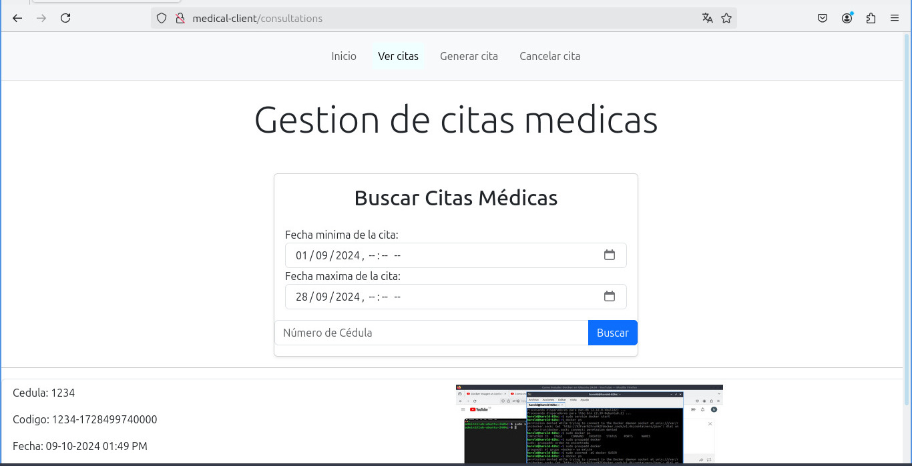

# Medical consultations client

A client that conect with a server to store, create, update and consult medical consultations.


## Authors

- [@Harold-Alvarado](https://github.com/HarDep)
- [@Sebastian-Mejia](https://github.com/Sebasmejia123)
- [@Luis-Rodriguez](https://github.com/luismiguel44)


## Environment Variables

To run the client, you will need to create the .env file in the root directory and add the following environment variables to your .env file

`SERVER_PORT`

`SERVER_HOST`


## Run Locally

Clone the project

```bash
  git clone https://github.com/HarDep/clie-dist-citas.git
```

Install dependencies

```bash
  npm install
```

Start the client

```bash
  npm run start
```
Now must make sure that the server is running. Then you can enter the address http://localhost:4200 in a browser to test the project.


## Run the project configuring Nginx as Web Server (For a ubuntu distribution)

To configure Nginx for a Web Server with the project, you will need to make sure that the server is running, and use the environment variables SERVER_PORT with value 80 and CLIENT_HOST with value medical-client.

### Prerrequisites:

You need to install Nginx, if you don't have it already you can install it with the next commands in a terminal.

```bash
  sudo apt update
  sudo apt install nginx
```

Or the equivalent commands on another distribution.

### 1. Configure the hosts file

Now you need to configure the hosts file to allow access to the local domain. So you need to edit the following line in the hosts file, you can find it in the file /etc/hosts.

```
  127.0.0.1 localhost medical-client
```

### 2. Configure Nginx

Now you have to configure Nginx, so first you have to add a file in the directory /etc/nginx/sites-available, you have to name it as "medical-client", en put the following content.

```
server {
        listen 80;
        listen [::]:80;

        root /var/www/medical-client;
        index index.html index.htm;

        server_name medical-client;

        location / {
        		    add_header Cache-Control "max-age=0, no-cache, no-store, must-revalidate";
				        add_header Pragma "no-cache";
                try_files $uri $uri/ =404;
        }

        error_page 404 /index.html;
}
```
Then you have to enable the file in the directory /etc/nginx/sites-enabled with the following command.

```bash
  sudo ln -s /etc/nginx/sites-available/medical-client /etc/nginx/sites-enabled/
```

### 3. Copy the project

No you have to build the project with the following command, you need to go at the root directory of the project.

```bash
  npm run build
```
Then you have to copy the content of the directory dist to the directory /var/www.


### 4. Start Nginx

Now you have to restart Nginx with the following command.

```bash
  sudo systemctl restart nginx
```
That's all, now you can access to the project in a browser using the url http://medical-client. You will see somthing like this.

